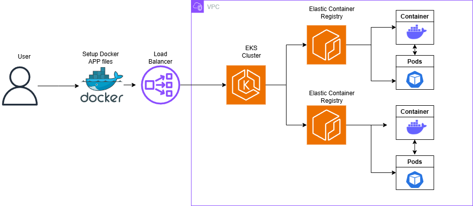

<p align="center">
  
  
## ☁️ MultiCloud, DevOps & AI Challenge - Day 2 - Automating AWS provisioning using Terraform  ☁️

This is part of the second project of the challenge/bootcamp! 

In this project we will be 


<h2>Environments and Technologies Used</h2>

  - Amazon Web Services
  - Github Codespaces
  - Amazon Bedrock
  - Docker
  - Kubernetes
  - Elastic Kubernetes Services
  - Elastic Container Registry

  
  
<h2>Features</h2>  


<h2>Step by Step Instructions</h2>

***1. Repo configuration***


NOTE: Keep in mind this is for a Linux environment, check the AWS documentation to install it in your supported OS.


   curl "https://awscli.amazonaws.com/awscli-exe-linux-x86_64.zip" -o "awscliv2.zip"
unzip awscliv2.zip
sudo ./aws/install


We then do `AWS configure` and enter our access and secret key along with the region. Output format set to JSON. With this command we will double check that our credentials are put in place for CLI:

```
aws sts get-caller-identity
```

We will then install Kubernetes CLI's which is `eksctl` and `kubectl`:

```
# Download and extract eksctl
curl --silent --location "https://github.com/weaveworks/eksctl/releases/latest/download/eksctl_$(uname -s)_amd64.tar.gz" | tar xz -C /tmp

# Move eksctl to /usr/local/bin
sudo mv /tmp/eksctl /usr/local/bin

# Download kubectl
curl -LO "https://dl.k8s.io/release/$(curl -L -s https://dl.k8s.io/release/stable.txt)/bin/linux/amd64/kubectl"

# Make it executable and move to /usr/local/bin
chmod +x kubectl
sudo mv kubectl /usr/local/bin/
```

***2. Create Docker Image for CloudMart and configure Backend and Frontend***

In this step we will be creating our docker image for CloudMart where we will grab the source code and generate the files.

We will begin by creating the Backend folder and downloading the source code:

```
mkdir -p challenge-day2/backend && cd challenge-day2/backend
wget https://tcb-public-events.s3.amazonaws.com/mdac/resources/day2/cloudmart-backend.zip
unzip cloudmart-backend.zip
```

We then create an .env file and provide with the following:

```
nano .env

PORT=5000
AWS_REGION=us-east-1
BEDROCK_AGENT_ID=<your-bedrock-agent-id>
BEDROCK_AGENT_ALIAS_ID=<your-bedrock-agent-alias-id>
OPENAI_API_KEY=<your-openai-api-key>
OPENAI_ASSISTANT_ID=<your-openai-assistant-id>
```
Then, we will create the folder for the frontend and download the source code:

```
cd ..
mkdir frontend && cd frontend
wget https://tcb-public-events.s3.amazonaws.com/mdac/resources/day2/cloudmart-frontend.zip
unzip cloudmart-frontend.zip
```

Lastly, we will setup our Dockerfile for our Docker Image:

```
nano Dockerfile
```

```
#Content of the Dockerfile

FROM node:16-alpine as build
WORKDIR /app
COPY package*.json ./
RUN npm ci
COPY . .
RUN npm run build

FROM node:16-alpine
WORKDIR /app
RUN npm install -g serve
COPY --from=build /app/dist /app
ENV PORT=5001
ENV NODE_ENV=production
EXPOSE 5001
CMD ["serve", "-s", ".", "-l", "5001"]
```


***3. Kubernetes Cluster Creation***

In this step we will make sure we configure our Kubernetes cluster to then deploy the backend and frontend properly.

We start by creating the cluster:

```
eksctl create cluster \
  --name cloudmart \
  --region us-east-1 \
  --nodegroup-name standard-workers \
  --node-type t3.medium \
  --nodes 1 \
  --with-oidc \
  --managed
```

Then, we connect to the eks cluster using the `kubectl` configuration.

```
aws eks update-kubeconfig --name cloudmart
```

Then we verify Cluster connectivity.

```
kubectl get svc
kubectl get nodes
```

Lastly, Create a Role & Service Account to provide pods access to services used by the application (DynamoDB, Bedrock, etc).

```
eksctl create iamserviceaccount \
  --cluster=cloudmart \
  --name=cloudmart-pod-execution-role \
  --role-name CloudMartPodExecutionRole \
  --attach-policy-arn=arn:aws:iam::aws:policy/AdministratorAccess\
  --region us-east-1 \
  --approve
```

***4. Final Step: Kubernetes Backend and Frontend Deployment***

In this final step, we will be deploying both the backend and frontend for kubernetes.


First, create an ECR Repository for the Backend and upload the Docker image to it


```
aws ecr create-repository --repository-name cloudmart-backend --region us-east-1 \
aws ecr create-repository --repository-name cloudmart-frontend --region us-east-1
```

​
Then, we will switch to the backend folder

```
cd challenge-day2/backend
​```

Follow the ECR steps to build your Docker image on the AWS Console.

Next, we will create a Kubernetes deployment file (YAML) for the Backend

```
cd ../..
cd challenge-day2/backend
nano cloudmart-backend.yaml

apiVersion: apps/v1
kind: Deployment
metadata:
  name: cloudmart-backend-app
spec:
  replicas: 1
  selector:
    matchLabels:
      app: cloudmart-backend-app
  template:
    metadata:
      labels:
        app: cloudmart-backend-app
    spec:
      serviceAccountName: cloudmart-pod-execution-role
      containers:
      - name: cloudmart-backend-app
        image: public.ecr.aws/l4c0j8h9/cloudmart-backend:latest
        env:
        - name: PORT
          value: "5000"
        - name: AWS_REGION
          value: "us-east-1"
        - name: BEDROCK_AGENT_ID
          value: "xxxxxx"
        - name: BEDROCK_AGENT_ALIAS_ID
          value: "xxxx"
        - name: OPENAI_API_KEY
          value: "xxxxxx"
        - name: OPENAI_ASSISTANT_ID
          value: "xxxx"
---

apiVersion: v1
kind: Service
metadata:
  name: cloudmart-backend-app-service
spec:
  type: LoadBalancer
  selector:
    app: cloudmart-backend-app
  ports:
    - protocol: TCP
      port: 5000
      targetPort: 5000

​```

Then, we will deploy the backend on Kubernetes

```
kubectl apply -f cloudmart-backend.yaml
​```


We can monitor the status of objects being created and obtain the public IP generated for the API

```
kubectl get pods
kubectl get deployment
kubectl get service
```
​
Now, we will be deploying the frontend kubernetes.


We will change the Frontend's .env file to point to the API URL created within Kubernetes obtained by the kubectl get service command

```
cd /challenge-day2/frontend
nano .env
```
​
Content of .env:

```
VITE_API_BASE_URL=http://<your_url_kubernetes_api>:5000/api
```

Then, we will create the yaml deployment file for the frontend

```
```yaml
nano cloudmart-frontend.yaml
```

```yaml
apiVersion: apps/v1
kind: Deployment
metadata:
  name: cloudmart-frontend-app
spec:
  replicas: 1
  selector:
    matchLabels:
      app: cloudmart-frontend-app
  template:
    metadata:
      labels:
        app: cloudmart-frontend-app
    spec:
      serviceAccountName: cloudmart-pod-execution-role
      containers:
      - name: cloudmart-frontend-app
        **image: public.ecr.aws/l4c0j8h9/cloudmart-frontend:latest**
---

apiVersion: v1
kind: Service
metadata:
  name: cloudmart-frontend-app-service
spec:
  type: LoadBalancer
  selector:
    app: cloudmart-frontend-app
  ports:
    - protocol: TCP
      port: 5001
      targetPort: 5001
```

Lastly, we will now deploy the Frontend on Kubernetes

```
kubectl apply -f cloudmart-frontend.yaml
```

Again, we can monitor the status of objects being created and obtain the public IP generated for the API

```yaml
kubectl get pods
kubectl get deployment
kubectl get service
```
***4. Cleanup***

Once we are done with the project we can proceed with cleaning up the resources:

```
kubectl delete service cloudmart-frontend-app-service
kubectl delete deployment cloudmart-frontend-app
kubectl delete service cloudmart-backend-app-service
kubectl delete deployment cloudmart-backend-app

eksctl delete cluster --name cloudmart --region us-east-1
```

<h2>Conclusion</h2>

In this project, I learned how to 
